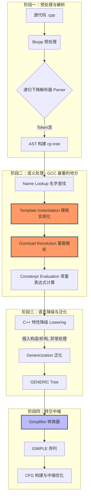

# 感受与LLVM前端的区别
## 视角提供
👉 GCC 在 GENERIC 之前，前端承担的职责 更重、更闭环
👉 LLVM 的 Clang 前端则是 更模块化、更早向 IR（LLVM IR）靠拢
### 闭环了什么？为什么更重？
- 简单来说，GCC 的前端不仅仅是“翻译官”，它在历史上更像是一个独立的语言管家。
#### 1. 为什么说 GCC 前端是“闭环”的？
在 GCC 的深度演进过程中，前端承担了大量本该由中端处理的任务。这种“闭环”体现在它试图在进入通用表示层（GENERIC/GIMPLE）之前，就在前端内部解决掉语言特性相关的所有问题。
- 语义检查与错误处理的耦合：
GCC 的前端往往深度参与语法分析以外的工作。例如，C++ 的模板展开、重载解析等极其复杂的逻辑，在早期 GCC 中是高度集成在前端代码里的。这意味着前端必须具备一套完整的“微型编译器”能力，而不只是产出抽象语法树。
- 私有语法树结构：
在 GCC 引入 GENERIC（一种通用的中间表示）之前，每种语言（C, C++, Fortran 等）都有自己独特的树结构（Tree nodes）。前端需要在自己的“小世界”里把源代码揉碎、消化，最后费劲地转换成后端的 RTL（Register Transfer Language）。这种“从语言源码直接到低级表示”的倾向，迫使前端必须闭环处理所有细节。
#### 2. 为什么 GCC 前端会“更重”？
“重”主要体现在逻辑臃肿和功能越位上：

- 早期缺乏统一的中端中间件
在 LLVM 诞生前，GCC 的中间表示主要是 RTL，它非常接近机器码。由于从高级语言（如 C++）直接跳到 RTL 太过巨大，前端不得不承担起高级优化和语言相关的简化工作。
结果： 前端代码库庞大，且不同语言的前端代码难以复用。

- 词法、语法与语义的深度耦合
GCC 的解析器（Parser）在历史上是手写的（或高度定制的），它在解析代码的同时就会进行大量的语义判断。
Clang 的做法： 哪怕源代码有错，我也尽量生成一个完整的 AST（抽象语法树），方便 IDE 做代码补全。
GCC 的做法： 如果发现错误，前端可能直接在解析阶段就卡住或陷入复杂的错误恢复逻辑。这种设计让前端逻辑异常沉重，很难被剥离出来作为独立的库使用。

- 对“语言规范”的极致还原
GCC 前端追求的是对语言标准 100% 的实现。为了追求性能，它往往会在前端阶段就进行一些不可逆的转换（Lowering），将高级语法折叠成更简单的结构。这种提前进行的“降级”操作增加了前端的复杂性。

| 特征 | GCC 前端 (Legacy Style) | LLVM / Clang 前端 |
|------|-------------------------|-------------------|
| 定位 | 语言翻译的“终点站”，直接产出后端指令 | 进入 LLVM 生态系统的“入口点” |
| 形态 | 庞大的宏和全局变量，难以拆分的单体 | 模块化的类库，可被 IDE、静态分析工具调用 |
| 中间转换 | 语言特定树 → GENERIC → GIMPLE | 语言 AST → LLVM IR |
| 闭环程度 | 高（前端需要处理掉大部分语言特性） | 低（尽快转化为通用的 IR，交给中端优化） |

#### Summary
总结：为什么 GCC 会演变成这样？
GCC 诞生于 20 世纪 80 年代，那个时代的计算机内存极度珍贵。为了节省内存，GCC 设计之初就倾向于“边读边处理”，而不是先构建一个精美的 AST 再慢慢处理。这种流式处理的思维导致了前端必须承担更多的职责，才能在有限的资源下完成编译。

而 Clang 是后发者，它站在了 GCC 的肩膀上，意识到“编译器前端不应只是编译器的附属品”，它还应该是 IDE 的后端、静态分析的工具。因此，Clang 选择将前端“减重”，只负责高质量的 AST 构建，而把沉重的转换逻辑推向了更标准化的 IR 层。

正如你所感知的：GCC 前端像是一个全能的工匠，自己搞定一切；而 Clang 前端像是一个专业的标准化车间，产出标准零件交给下一工序。

### 为什么当代 GCC 不彻底倒向 LLVM 模式？
- 极端优化的深度：
GCC 的中端优化（尤其是针对循环变换的 Graphite、针对跨文件优化的 LTO）在很多传统架构上依然比 LLVM 更有经验。这种深度绑定要求前端产出的 GIMPLE 必须包含大量的语义暗示，这种“重”换来的是极致的运行性能。
- 架构支持的广度：
作为一个编译器工程师，你一定深有体会：在很多冷门、嵌入式或古老的 DSP 架构（如你研究过的某些特殊指令集）上，GCC 的后端支持往往比 LLVM 更成熟。为了维持这种极其广泛的硬件兼容性，GCC 必须保持其内部表示的稳定性和复杂性。
- all
总结：目前的态势
LLVM (Clang)：赢在工程学。它是开发者的好朋友，是 IDE、重构工具、静态检查器的首选。
GCC：赢在工业积淀。它是一个更纯粹的“性能怪兽”，在系统内核、高性能计算等对二进制质量要求极高的领域，它依然是不可撼动的基石。

对于你这样关注底层（如 C2000、GCC 源码构建）的工程师来说：
当代 GCC 正在变得越来越清晰（比如现在的 C++ 实现让代码可读性好多了），但它那种“为了最终生成最优机器码，前端必须尽可能多压榨语言信息”的闭环思维，依然深深植根于其 DNA 中。

## gcc 前端的工作流程
### graphic
# 当代 GCC 前端（C++）编译流程深度解析

本文档描述了最新的 GCC（以 GCC 13/14 为例）处理 `.cpp` 文件时，前端（`cc1plus`）的核心工作流。

---

## 1. 整体流程图 (Mermaid)


## 2. 核心步骤理解
### 1. 预处理 (Preprocessing)
*   **工具**：集成在编译器内部的 `libcpp`。
*   **职责**：处理宏替换、文件包含 (`#include`) 和条件编译。
*   **关键点**：不仅是文本替换，还会生成 **Source Location Maps**，用于后续精准的错误定位（如列出宏展开的完整路径）。

### 2. 解析与 AST 构建 (Parsing & AST)
*   **数据结构**：`cp-tree` (C++ 专属树结构)。
*   **职责**：解析器将 Token 流转换为有意义的层级结构。GCC 的 C++ 前端在解析时是**语义驱动**的，即它会边解析边进行部分的语义判断。

### 3. 语义分析 (The "Heavy" Logic)
这是 GCC 前端最复杂、最闭环的阶段，包含：
*   **模板实例化**：这是 C++ 编译慢的主因。GCC 必须根据传入的参数类型，现场生成具体的函数或类代码。
*   **重载解析**：根据 C++ 标准（SFINAE 等规则），从几十个重选函数中挑选出最匹配的一个。
*   **常量计算**：解析 `constexpr` 函数，并在编译期计算出结果。

### 4. 降级与泛化 (Lowering & Genericization)
*   **降级**：将 C++ 高级语法（如 `for-range` 循环、析构函数的自动调用、虚函数跳转）转换为更基础的 C 风格结构。
*   **泛化**：将 `cp-tree` 转换为 `GENERIC` 树。`GENERIC` 是一种中间表示，旨在消除不同前端语言（C, C++, Fortran）之间的差异。

### 5. Gimplification (中端入口)
*   **目标**：生成 **GIMPLE**。
*   **操作**：将复杂的表达式树拆解为简单的**三地址码**。
*   **示例**：
    *   *原始*：`a = b + c * d;`
    *   *GIMPLE*：
        ```c
        t1 = c * d;
        a = b + t1;
        ```

---

## 3. 总结：GCC 与 LLVM 前端的关键分野

| 特征 | GCC 前端 (cc1plus) | LLVM 前端 (Clang) |
| :--- | :--- | :--- |
| **设计范式** | 单体化、高度集成 | 库化 (Library-based)、模块化 |
| **AST 性质** | 语义导向 (部分信息在转换中丢失) | 高保真 (保留几乎所有源码信息) |
| **降级时机** | 前端承担大量降级任务 | 尽快转化为通用的 LLVM IR |
| **主要产物** | GENERIC / GIMPLE | LLVM IR |

---

## 3. 补充问题
### A. 预处理器与词法分析的合体 (libcpp)
在 GCC 中，词法分析并不是一个孤立的、被 Parser 调用的被动组件。

- Token Stream 的生成：GCC 的预处理器 libcpp 在扫描源码时，就已经把词法分析给做了。它不是在 Parser 索要时才去读一个字符，而是通常会生成一个 Token 序列。

- “推”的逻辑：在某些历史版本或特定路径下，它更倾向于将处理好的信息“推”给后续阶段，或者在同一个循环里完成“扫描-识别-处理”。

### B. 语义信息的“即时注入”
这是 GCC 与 Clang 最大的不同点。GCC 的解析器（Parser）在处理 Token 的同时，会频繁地进行名字查找（Name Lookup）和类型绑定。

- 上下文敏感：GCC 在解析到一个标识符时，可能立刻就会去查符号表，判断它是一个类型名（Typedef）还是一个变量名。

- 直接构建 Tree：GCC 往往不等到整个语法块解析完，就在解析过程中不断地构建和修改其内部的 tree 节点。这种边读、边查、边建的方式，使得 Lexer 和 Parser 很难像 Clang 那样干净地分离。

### 为什么 GCC 这么干？
这种“不那么模块化”的设计，其实有其工程上的苦衷：

- 内存压力（历史原因）：
早期 GCC 诞生时内存非常昂贵。如果像 Clang 那样先构建一个完美的、保真的 AST（抽象语法树），内存开销会爆炸。GCC 选择“边读边消化”，消化完了就把中间过程丢掉，只保留最核心的语义树。

- 单次扫描（One-pass）的理想：
早期的编译器设计追求尽可能在一次扫描中完成尽可能多的工作。GCC 继承了这种 DNA，导致其前端逻辑像是一个复杂的“绞肉机”，源码进去，复杂的 Tree 结构就直接出来了。

## 自己的问题
那其实本质上clang前端是语法分析器先构建一个tree，再像parser申请token，而gcc是parser驱动，在token解系期间构建tree，这两者本质上有什么区别呢，看着在编译时消耗的资源差不多啊
答：

这是一个非常深刻的切入点。你提到的“资源消耗差不多”在单纯的**编译成功率**和**最终产物**上看确实如此，但在**软件工程架构**和**内存生命周期**上，这两者有着本质的代差。

我们可以从以下三个维度拆解这种“本质区别”：

---

### 1. 内存生命周期的“流式”与“持久”
这是两者在资源消耗上的最大不同点。

*   **GCC（流式处理 / Streaming）：**
    GCC 像是一个**“粉碎机”**。它在解析一个函数时，边看 Token 边构建 Tree。一旦这个函数解析完成并转换成 GIMPLE，GCC 就会尝试释放或重用该函数前端 AST 所占用的内存。
    *   **结果**：GCC 的内存占用曲线是**波浪形**的。它不需要在内存中同时保留整个文件的完整高保真 AST。
*   **Clang（持久化 / Persistent）：**
    Clang 像是一个**“摄影师”**。它的目标是先在内存中构建出一个**完全保真、逻辑完整**的整个文件的 AST。这个 AST 包含每一个分号、每一个隐式转换。
    *   **结果**：Clang 的内存占用通常会随文件复杂度**线性增长**，并在解析结束时达到顶峰。为了支持 IDE 的快速响应，这个 AST 往往会一直驻留在内存中。


---

### 2. 语境依赖：先知 vs 现学
*   **GCC 的“边走边看”**：
    由于 GCC 在解析 Token 时就开始构建 Tree，它必须实时维护一个极其复杂的符号表。如果 C++ 代码中有一个符号既可能是类型也可能是变量，GCC 必须在解析到那个 Token 的瞬间就做出决定。这导致了前端代码中存在大量的“全局状态”切换。
*   **Clang 的“延迟推断”**：
    Clang 倾向于先通过语法分析器把结构定下来。即使某些语义模糊，它也可以先构建出一个“待定”的 AST 节点。由于它的 Parser 是向 Lexer 索要 Token，它可以随时“预看”（Lookahead）后面的 Token 而不破坏当前的语义状态。

---

### 3. 本质区别：你是要“二进制”还是“信息”？

这决定了两个前端的设计上限：

| 维度 | GCC (Parser 驱动构建) | Clang (语法树驱动加载) |
| :--- | :--- | :--- |
| **核心目标** | **性能与转化**。尽快把代码变成后端能优化的 Tree/GIMPLE。 | **理解与分析**。构建一个机器可读的源码完整副本。 |
| **工具链友好度** | **差**。你想从 GCC 里问“第 10 行那个变量的所有引用在哪”，它很难回答，因为那部分 Tree 可能已经被“降级”了。 | **极佳**。AST 就在那，你可以随意遍历、查询、重构。 |
| **错误恢复** | **较难**。一旦边解析边构建时出错，后续的 Tree 可能是畸形的，容易引发连环报错。 | **强**。即使语法有错，它也能构建出“病态 AST”用于辅助 IDE 报错，而不会直接崩溃。 |

---

### 为什么你觉得资源消耗差不多？

在当代高性能 PC 上，编译一个普通 `.cpp` 文件，那几十 MB 的内存差异和几百毫秒的时间差确实很难感知。但在以下两种极端场景下，你会看到本质区别：

1.  **极大型文件 / 巨型模板库**：
    Clang 可能会因为要维护庞大的高保真 AST 而导致内存溢出（OOM），而 GCC 凭借其“解析完就丢”的流式处理，往往能在低内存环境下生存。
2.  **IDE 实时反馈**：
    如果你在写代码时，IDE 需要在后台实时检查语法。Clang 可以只重新解析变化的 Token 并局部更新 AST，速度极快。而 GCC 因为其解析逻辑与 Tree 构建深度绑定，很难做到高效的局部更新。

### 总结
**GCC 的前端是为“编译器”设计的，而 Clang 的前端是为“语言服务”设计的。**
