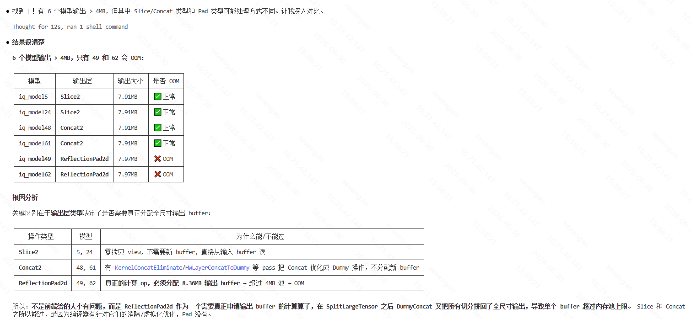

# 处女bug
## 1. 问题表象
Case Name: motionattgen_npu_a400_out
```
iq_model49、iq_model62：“memory is repeatedly freed”
单算子 ReflectionPad2d
```

## 2. 问题复现
### 2.1 take case
```
\\10.198.24.11\public_share\user\lloydhe\tnt-5875
motionattgen_npu_a400_out.zip
```

### 2.2 run
```
/home/sevengao/ai_repo/aic_v3/build/bin/ts_aic /home/sevengao/bugs/001_memory_repeated_free/iq_model49/iq_model49_sv.json --enable_csv_mem_report=true --dump_ir_after_pass=true --dump_ir_for_single_hw_layer=true --in-pattern=nchw --out-pattern=nchw --mem-opt=parallel --enable_fused_op_opt=true --enable_concat_op_eliminate=true --life-cycle-thres 0.43 --enable-live-time=true --mem-align 256 --vpu-split-mode=auto --bi-interp-split-mode=split_h --bi-interp-split-opt=split_h --enable-inplace-opt=true --enable-param-replace=true  --mfnr_loadnum_perf_optimize --op-order-sort=depth --param-data-fetch-mode=dyna --enable-conv-concat-opt=true --conv-split-opt=split_h_co -o .
```
#### 编译命令解析
- 输入 / 输出

| 参数    | 值                  | 含义             |
| ----- | ------------------ | -------------- |
| input | iq_model49_sv.json | 输入模型（graph IR） |
| `-o`  | `.`                | 输出到当前目录        |

- layout（张量格式）

| 参数              | 值    | 含义        |
| --------------- | ---- | --------- |
| `--in-pattern`  | nchw | 输入布局 NCHW |
| `--out-pattern` | nchw | 输出布局 NCHW |

- 内存优化（重点）

| 参数                     | 值        | 含义                    | 影响等级 |
| ---------------------- | -------- | --------------------- | ---- |
| `--mem-opt`            | parallel | 基于 memory reuse 的并行调度 | 🔴 高 |
| `--enable-live-time`   | true     | 开启 tensor 生命周期分析      | 🔴 高 |
| `--life-cycle-thres`   | 0.43     | 生命周期>43% → 倾向延迟释放/尾分配 | 🔴 高 |
| `--enable-inplace-opt` | true     | 允许原地复用 buffer         | 🔴 高 |
| `--mem-align`          | 256      | 内存对齐（DMA/VPU SIMD）    | 🟡 中 |

- 图优化（Graph Optimizations）

| 参数                             | 值       | 含义                 | 影响        |
| ------------------------------ | ------- | ------------------ | --------- |
| `--enable_fused_op_opt`        | true    | Conv/Act 等算子融合     | 🔴        |
| `--enable_concat_op_eliminate` | true    | 删除冗余 concat        | 🔴        |
| `--enable-conv-concat-opt`     | true    | Conv + concat 特化优化 | 🔴        |
| `--enable-param-replace`       | true    | 常量/参数替换            | 🟡        |
| `--mfnr_loadnum_perf_optimize` | enabled | MFNR（多帧降噪）加载优化     | 🔴 CV场景特化 |

- VPU / 硬件切分

| 参数                       | 值          | 含义                           | 影响   |
| ------------------------ | ---------- | ---------------------------- | ---- |
| `--vpu-split-mode`       | auto       | 自动VPU tile切分                 | 🔴   |
| `--conv-split-opt`       | split_h_co | Conv按 height + channel out切分 | 🔴🔥 |
| `--bi-interp-split-mode` | split_h    | resize按高度切分                  | 🔴   |
| `--bi-interp-split-opt`  | split_h    | resize优化策略                   | 🔴   |

- 调度 / 执行顺序

| 参数                | 值     | 含义           |
| ----------------- | ----- | ------------ |
| `--op-order-sort` | depth | 按 DAG 深度优先调度 |

- 参数 / 权重管理

| 参数                        | 值    | 含义     | 影响 |
| ------------------------- | ---- | ------ | -- |
| `--param-data-fetch-mode` | dyna | 权重按需加载 | 🔴 |

- Debug / profiling

| 参数                              | 值    | 含义                   |
| ------------------------------- | ---- | -------------------- |
| `--enable_csv_mem_report`       | true | 输出 memory CSV report |
| `--dump_ir_after_pass`          | true | 每个 pass dump IR      |
| `--dump_ir_for_single_hw_layer` | true | HW layer IR dump     |

**memory-bound CV/ISP模型的 VPU tile 编译（debug + profiling 模式）**

**挂了, 需要进一步确认问题是否为真实**
### 2.3 确认其他是否可以编过
50可以\63也可以, 确认了我的编译流程和执行流程没有问题。

### 2.4 留存log，进一步进行分析
#### 2.4.1 log丢给gpt查看
##### 表面原因

tensor size 过大，内存爆了，只给4M，但是要用8M
##### 实际原因

`Concat → Pad → (DummySlice) → output expand`

↓↓↓↓↓↓↓↓↓↓↓↓↓↓↓↓↓↓↓↓↓↓↓↓↓↓↓

`materialized tensor ≈ 2× input size or more`

↓↓↓↓↓↓↓↓↓↓↓↓↓↓↓↓↓↓↓↓↓↓↓↓↓↓↓

booooom！！！

##### 自己找找
因为是`"mem_size": 8355840`导致了mem爆掉，到上一层IR(`058.DumpAnalysisGraphPass`)找一找，发现了奇怪的tensor：
```
        {
            "name": "2FPad_1_output_0_out",
            "shape": [
                1,
                2,
                1088,
                1920
            ],
            "type": "Fp16_NCHW_8355840B_8160.00K_7.97M",
            "addr": 4294967295,
            "mem_size": 8355840
        },
```
- 发现一开始就有大tensor输入了，那是不是切分出了问题呢？
SplitLargeTensor 这个是负责切分的，为什么没生效？
切的是计算，不是输出 buffer。
- 那合理追问：真的是前端的问题么？切分后的同模型是否有同样大小的 tensor buffer 出现

- 出现了，但是发现
Slice2和DummyConcat的output都不会有超过4m的内存落盘，而ReflectionPad2d是完全的增量修饰算子，是否应该在其上游添加一个切分的算子？类似Slice2

真正开始使用源码进行询问，尝试进行功能性修复，claude给出添加pass，切分让其输出不让buffer出现oom现象

## 3 Debug
### 3.1 编译debug模式
`./build.sh --no-gtest -bt Debug --no-asan-leak`

### 3.2 

## 4. 知识总结
