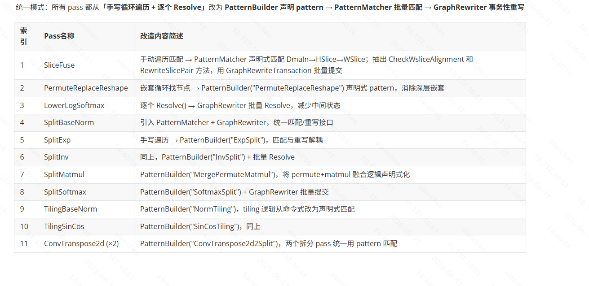

claude 大哥的经验  Write(.claude/projects/-home-sevengao-ai-repo-aic-v3/memory/refactoring-playbook.md)

# aic_v3 图IR 中指定顺序操作的pattern match重构

功能源码：https://gerrit.imv.local/c/aic_v2/+/73736


## 任务列表


## Pass速览及改写
### PermuteReplaceReshape
#### pass功能
- 重要概念补全
    - Reshape：
        ```
        [2,3,4]
        ↓
        reshape
        ↓
        [6,4]
        ```
        只修改解释方式不改变内存存放方式。
    - Permute：调整维度顺序:`[N,C,H,W]->[N,H,W,C]`,涉及memory mv即DMA搬运，因此代价较高。

把某些 Reshape 算子替换成 Permute（+ 辅助 Reshape），因为 MTE 硬件上 Permute 执行效率更高。
Reshape 在框架层面是"零成本"的（只改 shape 描述不搬数据），但在 NPU 硬件上，数据按固定布局存储，维度重排需要实际搬运。Permute 是 MTE 硬件直接支持的维度转置指令，对于某些 shape 变换比 Reshape 的实现路径更快。

三种处理路径

输入 [C,H,W] → 输出 [C',H',W'] 的 Reshape：

情况1：简单转置（2个 Permute 搞定）
  例：[1,H,W]→[H,W,1] → Permute(WHC) + Permute(HCW)

情况2：另一类简单转置
  例：[W,1,C]→[H,C,1] → Permute(HCW) + Permute(WHC)

情况3：复杂变换（需分解为 Reshape→Permute→Reshape→Permute→Reshape 链条）
  降维→转置→再降维→再转置→恢复维度

还有一个特殊子路径 SpecReplaceImpl：当输出只有 C 维非 1 时（[C,1,1]），用 Reshape 摊平 → CWH Permute 一次完成。

约束条件

不是所有 Reshape 都能被替换，会被以下条件过滤：

┌───────────────────┬───────────────────────────────────────┐
│       条件        │                 含义                  │
├───────────────────┼───────────────────────────────────────┤
│ DisEn_Condition_1 │ 输出 H=1 且 C=1（没必要替换）         │
├───────────────────┼───────────────────────────────────────┤
│ DisEn_Condition_2 │ 输出 W = 输入总大小（无实际维度变换） │
├───────────────────┼───────────────────────────────────────┤
│ DisEn_Condition_3 │ W 对齐了且 32B 对齐（硬件原生友好）   │
├───────────────────┼───────────────────────────────────────┤
│ DisEn_Condition_4 │ 小 tensor（<16KB 且 32B 对齐）        │
├───────────────────┼───────────────────────────────────────┤
│ DisEn_Condition_5 │ L1 内存不够（中间 tensor 超 4MB）     │
└───────────────────┴───────────────────────────────────────┘

一个小细节

这个 pass 自己手写了"攒 vec → 批量 ReleaseNode → 单次 Resolve"模式（292-298行），没用 BatchRewriter。这也印证了 BatchRewriter 就是把这种重复出现的模式封装成了可复用工具。

#### 重构逻辑
旧 `RunOnModule` 有三个"味道"：

1. **手写图遍历**：通过 `GraphViewer` 获取拓扑序，手动 for 循环 + `dynamic_cast<Reshape*>` 筛选类型
2. **手写批量清理**：`std::vector<NodeIndex> nodes_to_remove` → 逆序 `ReleaseNode` → 条件 `Resolve()`
3. **混合关注点**：122 行的 RunOnModule 中混杂了模式筛选、优先级分发、改写调用、节点清理四层逻辑

SliceFuse 重构已经提供了标准模式：PatternBuilder 声明匹配 → PatternMatcher 执行匹配 → BatchRewriter 批量清理。PermuteReplaceReshape 也应遵循这个模式。

### LowerLogSoftmax（已重构）
#### pass功能
LowerLogSoftmax 是一个 Module Pass，负责将高层的 LogSoftmax 算子分解（lowering）为硬件可直接执行的基本算子序列。

数学原理：`LogSoftmax(x_i) = (x_i - max(x)) - log( Σ_j exp(x_j - max(x)) )`

分解步骤：ReduceMax → Sub → Exp → ReduceSum → Log → Sub

特殊路径：当输入通道数超过 4096 时，走 channel-split 路径（Slice → 各 slice 独立 log-softmax → Concat）

#### 重构逻辑
- 旧：`GraphViewer → for → dynamic_cast<LogSoftmax*>`，两个 Impl 各自 `ReleaseNode + Resolve`
- 新：`PatternBuilder("LowerLogSoftmax").MatchNode("logsoftmax", NodeType<LogSoftmax>())` + `BatchRewriter`
- `SatisfySplitC()` 分派保留在循环中（和 SplitSoftmax 完全相同的模式）


### SplitBaseNorm（已重构）
`引入PatternMatcher+ GraphRewriter，统一匹配/重写接口`
#### pass功能
将 LayerNorm/RMSNorm/InstanceNorm 等高层 Norm 算子分解为 VPU 直接支持的逐元素运算序列。

**硬件背景**：VPU 只支持 Eltwise（加减乘除）、Activation（LUT 查表激活）、Reduce（求均值/求和）。没有原生 Norm 指令，必须通过数学恒等式展开。

**LayerNorm 分解**（`y = (x - mean) / sqrt(var + eps) * gamma + beta`）：
```
x → ReduceMean(HWC) → Sub(x, mean)         →  x - mean
                    → Mul(x-mean, x-mean)   →  (x-mean)²
                    → ReduceSum(HWC)        →  var
                    → BatchNorm(var, eps)   →  var+eps (用 BatchNorm 的 scale+shift 实现 add eps)
                    → InvSqrt(var+eps)      →  1/sqrt(var+eps)  (LUT 查表)
                    → Mul(x-mean, inv)      →  归一化后
                    → BatchNorm(gamma, beta)→  最终输出 (Mul+Add 合并为一个 BatchNorm)
```

**4 种 Norm 类型**：LayerNorm / InstanceNorm / RMSNorm / RMSNorm2，每种走独立的 Impl 函数。通过 `NormType → ImplFunc` 的 map 分派。

**InstanceNorm** 额外处理 2D/1D 两种模式（H==1 时走 1D 路径），需要检查输入维度。

#### 重构逻辑
- 旧：`GraphViewer → for → dynamic_cast<BaseNorm*>`，4 个 Impl 函数各自 `ReleaseNode + Resolve`
- 新：`PatternBuilder("NormSplit").MatchNode("basenorm", NodeType<BaseNorm>())` + `BatchRewriter`
- map dispatch 保留在循环中（和 SplitSoftmax 的 `SatisfySplitC` 分派同理）
- 4 个 Impl 函数去掉 ReleaseNode/Resolve（4 处替换），统一由 BatchRewriter.Commit() 处理

### SplitExp/SplitInv/SplitSoftmax/SplitMatmul（已重构）
`手写遍历 → PatternBuilder，匹配与重写解耦`
#### pass功能

**SplitExp**：`y = exp(x)` → BatchNorm(shift) + Activation(exp_lut) + BatchNorm(scale)

硬件背景：VPU 的 Activation 指令支持 LUT 查表实现 exp，但要求输入 ≤ 0（数值稳定）。所以先做 shift（`x' = x + shift, x' ≤ 0`），再查表 `exp(x')`，最后 scale（`y = exp(x') * exp(-shift)`），三个算子。VPU 一次 Act 指令完成。

**SplitInv**：`y = 1/x` 或 `y = 1/sqrt(x)` → Activation(lut) + BatchNorm + Eltwise(mul/sub) 链

硬件背景：VPU 的 Activation 支持 inv/inv_sqrt 模式（LUT 近似），但精度不够直接当输出。需要通过多项式逼近补偿：Activation（初始近似）→ BatchNorm（系数调整）→ Eltwise（Mul/Sub 逼近项）→ 最终 Mul/Sub 组合。Inv 和 InvSqrt 走不同链长（Inv: 5 个算子，InvSqrt: 7 个算子，因为 sqrt 逼近需要更高阶）。

**SplitSoftmax**：`softmax(x) = exp(x-max) / sum(exp(x-max))` → 6 步基础算子

硬件背景：无原生 Softmax 指令。分解为标准数值稳定公式：
```
ReduceMax(HWC) → Sub(x, max) → Activation(exp_lut) → ReduceSum(HWC) → 1/sum(LUT近似) → Mul(exp_out, recip)
```
其中 `1/sum` 用 Activation(inv_sqrt) + 多项式逼近（4 个 Eltwise）实现。

当 C 维 > 4096（CHANNEL_MAX_DIM）时走 `SoftmaxSplitChannel` 路径：先沿 C 维 Slice → 每个 slice 各自 softmax → Concat 拼回。这规避了 Activation/Reduce 的通道数硬件限制。

**三个 pass 的结构共性**：单算子匹配 → 创建 3~12 个替代算子链 → 删除原算子。替代算子全部是 VPU 原生指令（Activation/Eltwise/Reduce/BatchNorm/Slice/Concat）。

#### 重构逻辑
- 旧：`GraphViewer → for (idx : order) → dynamic_cast<T*>`，Impl 内部直接 `ReleaseNode + Resolve`（每匹配一个就 Resolve 一次）
- 新：`PatternBuilder("ExpSplit").MatchNode("exp", NodeType<Exp>())` + `BatchRewriter` 延迟删除+单次 Resolve
- SplitSoftmax：模式选择逻辑 `SatisfySplitC()` 保留在循环中，不变
- SplitMatmul：两阶段——① `PerformMatmulConversion`（单节点 Matmul→Permute+Matmul 链）；② `MergePermuteMatmul`（**多节点子图匹配**：`Permute(WHC)→Matmul` 输入侧 + `Matmul→Permute(WHC)` 输出侧，用 `Chain` + `SingleUse` + `Attr` 声明式匹配）。这是 11 个 pass 中唯一真正用到 PatternMatcher 边匹配能力的 pass

### TilingBaseNorm/TilingSinCos（已重构）
`PatternBuilder，tiling 逻辑从命令式改为声明式匹配`
#### pass功能

这两个 pass 位于"Split 之前"——**先切分再 lowering**。如果 tensor 太大导致中间结果超过 L1 buffer（1MB），Split 阶段产生的算子链将无法分配内存。所以 tiling pass 先把大 tensor 切片，让每个 slice 独立走后续的 Split→Kernel→Analyse 流程。

**TilingBaseNorm**（LayerNorm W 维分块）：
```
触发条件：input size > 1MB && C ≤ 4096 && W > 32
流程：LayerNorm → Slice(W 维) × N → 每个 W slice 独自 LayerNorm → Concat(W 维)
```
只切 W 维（不切 C/H），因为 C 维 > 4096 时 Norm 计算跨通道依赖过重，切 C 会破坏数学等价性。

**TilingSinCos**（Sin/Cos H 维分块）：
```
触发条件：total_footprint = in × 2 + out + 876(LUT) > local_mem_limit
流程：Sin/Cos → Slice(H 维) × N → 每个 H slice 独自 Sin/Cos → Concat(H 维)
```
Sin/Cos 的 Activation 需要 LUT 表（~876B），加上输入输出两份 buffer。`CalculateTilesForDim` 按 footprint / safe_limit 计算最少 tile 数，打 0.7 安全系数。

**共同点**：条件性改写——不超限就不动，超限才切。这是**预防性 tiling**，不是算子分解。`need_tiling` 判断保留在循环中，和 PatternMatcher 的模式声明是正交的两个关注点。

#### 重构逻辑
- TilingSinCos 匹配两种类型：`MatchNode("op", lambda: Sin||Cos)`
- 旧的 `nodes_to_remove` vec → BatchRewriter
- 非 tiling 路径不调 RemoveNode（原样保留），BatchRewriter 空提交无副作用

### ConvTranspose2d (x2)（已重构）
`PatternBuilder，两个拆分 pass 统一用 pattern 匹配`
#### pass功能

两个 pass 都处理转置卷积（反卷积/Deconvolution）——因为 MPU 只支持前向 Conv2d，不支持 Deconv。

**ConvTranspose2dSplit**（版本 1）：
```
Deconv(stride=1) → Pad + Conv2d(stride=1, kernel=orig)
Deconv(stride=2) → Interp(2x upsample, zero-fill) + Pad + Conv2d(stride=1, kernel=orig)
```
- stride=2 时先 Interp 插零上采样 2x，再 Conv2d — MPU 的 Conv 只做 stride=1，上采样由 MTE 的 Interp 完成
- Pad 处理 output_padding：ConvTranspose 的 output_pad 在正向 Conv 里无法表达，需要额外 Pad 补齐

**ConvTranspose2d2Split**（版本 2，处理不同参数布局）：
```
stride=1 → ConvTranspose2d(stride=1)  (降级到版本 1)
stride=2 → Pad + Conv2d(output_ch=4×orig, stride=1) + PixelShuffle(2x) + Slice(H/W)
```
- stride=2 时用 `Conv2d + PixelShuffle` 代替 Interp：Conv 输出 4 倍通道 → PixelShuffle 重排为 2x 空间上采样
- 输出尺寸可能多了 1px，需要 Slice 裁掉
- 支持 wino_mode（Winograd 加速卷积）

**两个 pass 的关系**：版本 2 是版本 1 的增强版（支持 Winograd + PixelShuffle 路径），但参数布局不同，不能直接合并。编译时根据 JSON 中算子类型选择走哪个 pass。

#### 重构逻辑
- 旧：inline 改写逻辑嵌套在遍历循环内，ConvTranspose2d 直接 `ReleaseNode+Resolve` 每次
- 新：循环体保留改写逻辑，`rewriter.RemoveNode` 替代 `ReleaseNode`，`rewriter.Commit()` 替代 `Resolve`