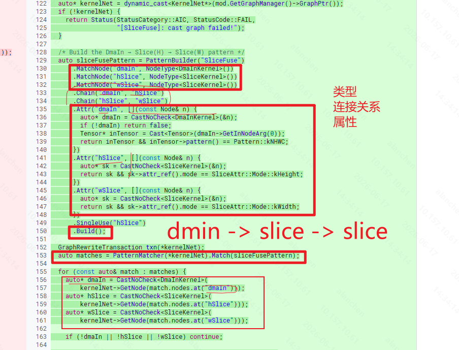

claude 大哥的经验  Write(.claude/projects/-home-sevengao-ai-repo-aic-v3/memory/refactoring-playbook.md)

# aic_v3 图IR 中指定顺序操作的pattern match重构

功能源码：https://gerrit.imv.local/c/aic_v2/+/73736



## 任务列表


## Pass速览及改写
### PermuteReplaceReshape
#### pass功能
- 重要概念补全
    - Reshape：
        ```
        [2,3,4]
        ↓
        reshape
        ↓
        [6,4]
        ```
        只修改解释方式不改变内存存放方式。
    - Permute：调整维度顺序:`[N,C,H,W]->[N,H,W,C]`,涉及memory mv即DMA搬运，因此代价较高。

把某些 Reshape 算子替换成 Permute（+ 辅助 Reshape），因为 MTE 硬件上 Permute 执行效率更高。
Reshape 在框架层面是"零成本"的（只改 shape 描述不搬数据），但在 NPU 硬件上，数据按固定布局存储，维度重排需要实际搬运。Permute 是 MTE 硬件直接支持的维度转置指令，对于某些 shape 变换比 Reshape 的实现路径更快。

三种处理路径

输入 [C,H,W] → 输出 [C',H',W'] 的 Reshape：

情况1：简单转置（2个 Permute 搞定）
  例：[1,H,W]→[H,W,1] → Permute(WHC) + Permute(HCW)

情况2：另一类简单转置
  例：[W,1,C]→[H,C,1] → Permute(HCW) + Permute(WHC)

情况3：复杂变换（需分解为 Reshape→Permute→Reshape→Permute→Reshape 链条）
  降维→转置→再降维→再转置→恢复维度

还有一个特殊子路径 SpecReplaceImpl：当输出只有 C 维非 1 时（[C,1,1]），用 Reshape 摊平 → CWH Permute 一次完成。

约束条件

不是所有 Reshape 都能被替换，会被以下条件过滤：

┌───────────────────┬───────────────────────────────────────┐
│       条件        │                 含义                  │
├───────────────────┼───────────────────────────────────────┤
│ DisEn_Condition_1 │ 输出 H=1 且 C=1（没必要替换）         │
├───────────────────┼───────────────────────────────────────┤
│ DisEn_Condition_2 │ 输出 W = 输入总大小（无实际维度变换） │
├───────────────────┼───────────────────────────────────────┤
│ DisEn_Condition_3 │ W 对齐了且 32B 对齐（硬件原生友好）   │
├───────────────────┼───────────────────────────────────────┤
│ DisEn_Condition_4 │ 小 tensor（<16KB 且 32B 对齐）        │
├───────────────────┼───────────────────────────────────────┤
│ DisEn_Condition_5 │ L1 内存不够（中间 tensor 超 4MB）     │
└───────────────────┴───────────────────────────────────────┘

一个小细节

这个 pass 自己手写了"攒 vec → 批量 ReleaseNode → 单次 Resolve"模式（292-298行），没用 BatchRewriter。这也印证了 BatchRewriter 就是把这种重复出现的模式封装成了可复用工具。

#### 重构逻辑
旧 `RunOnModule` 有三个"味道"：

1. **手写图遍历**：通过 `GraphViewer` 获取拓扑序，手动 for 循环 + `dynamic_cast<Reshape*>` 筛选类型
2. **手写批量清理**：`std::vector<NodeIndex> nodes_to_remove` → 逆序 `ReleaseNode` → 条件 `Resolve()`
3. **混合关注点**：122 行的 RunOnModule 中混杂了模式筛选、优先级分发、改写调用、节点清理四层逻辑

SliceFuse 重构已经提供了标准模式：PatternBuilder 声明匹配 → PatternMatcher 执行匹配 → BatchRewriter 批量清理。PermuteReplaceReshape 也应遵循这个模式。

### LowerLogSoftmax(先不重构)
#### pass功能
LowerLogSoftmax 是一个 Module Pass，负责将高层的 LogSoftmax 算子分解（lowering）为硬件可直接执行的基上础算子序列。

数学原理

利用数值稳定的恒等变换：

LogSoftmax(x_i) = (x_i - max(x)) - log( Σ_j exp(x_j - max(x)) )

分解步骤

ReduceMax → Sub → Exp → ReduceSum → Log → Sub

1. ReduceMax — 求输入在 HWC 维度上的最大值
2. Sub — 元素级减法：x - max(x)
3. Exp — 对结果做指数运算（查表实现）
4. ReduceSum — 沿通道维度求和
5. Log — 对求和结果取自然对数（查表实现）
6. Sub — 最终输出：(x - max) - log(sum)

特殊路径

当输入通道数超过 4096 时，会走 channel-split 路径：将输入沿通道维度切分成多个小块，分别做 log-softmax 分解后再拼接回来，以规避硬件通道维度的限制。
#### 重构逻辑


### SplitBaseNorm

### SplitExp/Splitinv/SplitMatmul/SplitSoftmax

### TilingBaseNorm/TilingSinCos

### ConvTranspose2d (x2)